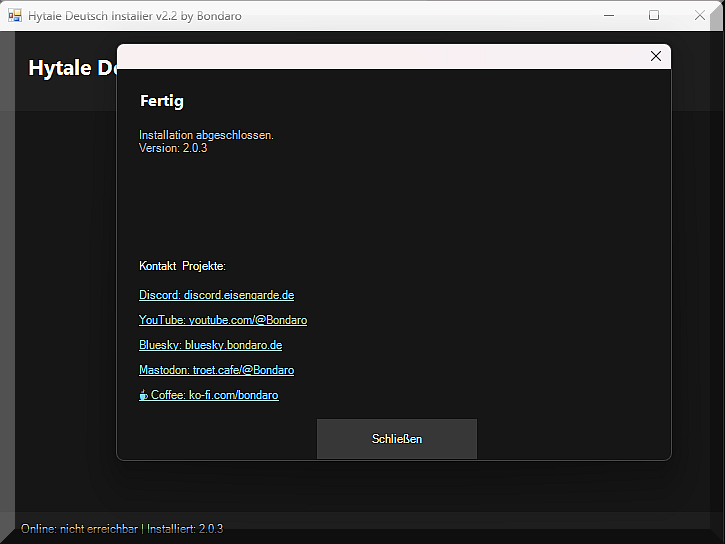
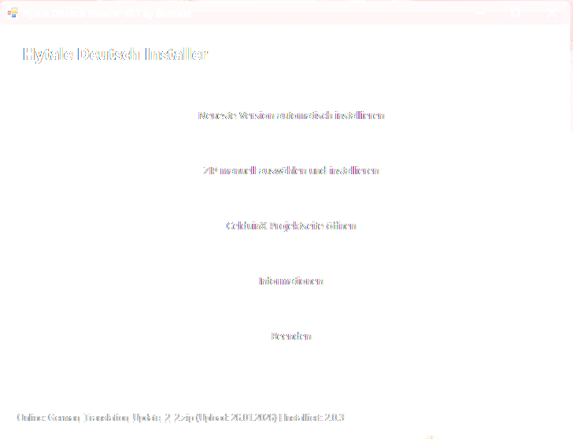
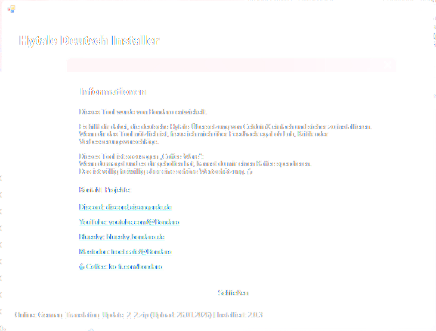

  

---

# Derzeit pausiert, da sich die Situation beim Originalprojekt geändert hat.
---
# Hytale Deutsch Installer
Ein kleines Tool, das die deutsche [Hytale](https://hytale.com/)-Übersetzung von **[CelduinX](https://legacy.curseforge.com/members/celduinx/projects)** einfach und sicher installiert.
Kein manuelles Kopieren von Dateien, kein Gefummel mit Ordnern entweder ZIP auswählen oder die neueste Version automatisch installieren.

---

## Was macht das Tool?
Der Installer:
- prüft online, ob eine neue Version der Übersetzung verfügbar ist  
- lädt bei Bedarf die aktuelle ZIP-Datei von [CurseForge](https://www.curseforge.com/hytale) herunter  
- entpackt die Sprachdateien  
- kopiert sie automatisch an die richtigen Stellen in deinem Hytale-Ordner  
- zeigt an, welche Version installiert ist  
- erlaubt alternativ auch die manuelle Auswahl einer ZIP-Datei  
- unterstützt Drag & Drop von ZIP-Dateien

---

## Voraussetzungen
- Windows  
- Hytale muss installiert sein  
- Keine Installation des Tools nötig einfach starten  

Du kannst die EXE-Datei überall speichern und von dort aus starten.

---

## Welche Ordner und Dateien werden verwendet?
Das Tool arbeitet mit folgenden Pfaden:
### Hytale-Ordner (Ziel der Installation)
`` %APPDATA%\Hytale\``

Dort werden Sprachdateien hierhin kopiert:
``
install\release\package\game\latest\Client\Data\Shared\Language\de-DE
install\pre-release\package\game\latest\Client\Data\Shared\Language\de-DE
``
### Eigene Tool-Daten
Das Tool legt einen kleinen Ordner für seine Statusdaten an:
`` %APPDATA%\HytaleDeutschInstaller\ ``
Darin wird gespeichert:
- `state.json` → merkt sich, welche Version zuletzt installiert wurde

### Temporäre Dateien
Beim automatischen Download wird kurzzeitig eine Datei im Temp-Ordner genutzt:

`` TEMP%\hytale_latest.zip ``
Diese wird nur für den Installationsvorgang verwendet.

---

## Online-Abfrage
Das Tool greift auf die offizielle CurseForge-API zu:

`` https://www.curseforge.com/api/v1/mods/1429064/files ``

Dort werden folgende Informationen abgefragt:
- Name der neuesten Datei  
- Upload-Datum  
- Download-Link  

So kann zuverlässig geprüft werden, ob ein Update verfügbar ist.

---

  
  
  

## Buttons im Programm
**Neueste Version automatisch installieren**  
→ Lädt die aktuellste Version von CurseForge herunter und installiert sie.

**ZIP manuell auswählen und installieren**  
→ Du wählst selbst eine ZIP-Datei aus (z. B. von deinem PC).

**Projektseite öffnen**  
→ Öffnet die CurseForge-Seite der Übersetzung im Browser.

**Informationen**  
→ Zeigt Infos zum Tool und zum Projekt.

**Beenden**  
→ Schließt das Programm vollständig.

---
## Hinweis
Dieses Tool installiert **nur die Übersetzung von CelduinX**.  
Es ist kein offizielles Hytale-Tool und steht in keiner Verbindung zu Hypixel Studios.
---
## Entwickler
Dieses Tool wurde von **Bondaro** entwickelt.
Feedback, Ideen und Verbesserungsvorschläge sind jederzeit willkommen.
Wenn dir das Tool hilft und du möchtest, kannst du mich hier unterstützen:
https://ko-fi.com/bondaro

## ⬇️ Download
👉 **[Hytale Deutsch Installer v2.2 herunterladen](https://github.com/Bondaro/hytale-deutsch-installer/releases/latest/download/Hytale.Deutsch.Installer.exe)**
## Hinweis zu Windows SmartScreen:
Da dieses Tool kein kommerziell signiertes Zertifikat besitzt, kann Windows beim ersten Start eine Warnung anzeigen.
Klicke in diesem Fall auf „Weitere Informationen“ → „Trotzdem ausführen“.
Das Tool ist sicher und enthält keinen schädlichen Code.
